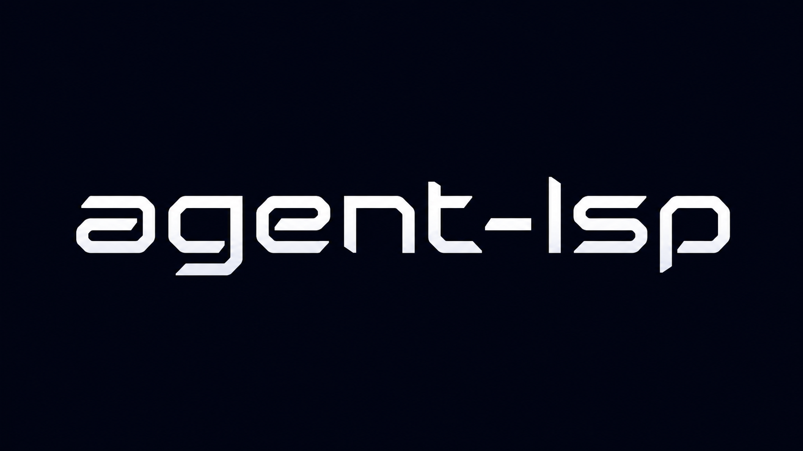

<p align="center">
  
</p>

[](https://github.com/blackwell-systems)
[](https://microsoft.github.io/language-server-protocol/specifications/lsp/3.17/specification/)
[](#multi-language-support)
[](#tools)
[](LICENSE)
[](https://agentskills.io)
[](https://github.com/punkpeye/awesome-mcp-servers)
<a href="https://github.com/blackwell-systems/mcp-assert"></a>

**The most complete MCP server for language intelligence.** 53 tools, 30 CI-verified languages, 21 agent workflows. Single Go binary.

AI agents make incorrect code changes because they can't see the full picture: who calls this function, what breaks if I rename it, does the build still pass. Language servers have the answers, but existing MCP bridges either cold-start on every request or expose raw tools that agents use incorrectly.

agent-lsp is a **stateful runtime** over real language servers. It indexes your workspace once, keeps the index warm, and adds a **skill layer** that encodes correct multi-step operations so they actually complete.

**How the pieces fit together:** [LSP](https://microsoft.github.io/language-server-protocol/) (Language Server Protocol) is how editors get code intelligence — completions, diagnostics, go-to-definition. [MCP](https://modelcontextprotocol.io/) (Model Context Protocol) is the standard way AI tools like Claude Code discover and call external tools. agent-lsp bridges the two: language server intelligence, accessible to AI agents.

### How it works

One agent-lsp process manages your language servers. Point your AI at `~/code/`. It routes `.go` to gopls, `.ts` to typescript-language-server, `.py` to pyright. No reconfiguration when you switch projects. The session stays warm across files, packages, and repositories.

### Tested, not assumed

Every other MCP-LSP implementation lists supported languages in a config file. None of them run the actual language server in CI to verify it works.

agent-lsp CI runs **30 real language servers** against real fixture codebases on every push: Go, Python, TypeScript, Rust, Java, C, C++, C#, Ruby, PHP, Kotlin, Swift, Scala, Zig, Lua, Elixir, Gleam, Clojure, Dart, Terraform, Nix, Prisma, SQL, MongoDB, and more. When we say "works with gopls," that's a verified, automated claim, not a hope.

### Speculative execution

Simulate changes in memory before writing to disk. No other MCP-LSP implementation has this.

`simulate_edit_atomic` previews the diagnostic impact of any edit. You see exactly what breaks before the file is touched. `simulate_chain` evaluates a sequence of dependent edits (rename a function, update all callers, change the return type) and reports which step first introduces an error.

8 speculative execution tools. See [docs/speculative-execution.md](./docs/speculative-execution.md) for the full workflow.

### Token savings

Structured LSP responses use **5-34x fewer tokens** than grep/read on the same tasks. On HashiCorp Consul (319K lines), a blast-radius analysis uses 17.7MB via grep vs 841KB via LSP, reducing 5,534 tool calls to 119. Savings scale with codebase size. See [docs/token-savings.md](./docs/token-savings.md) for the full experiment across five codebases.

### Persistent daemon mode

Python and TypeScript projects need minutes of background indexing before `get_references` works. agent-lsp automatically spawns a persistent daemon broker that survives between sessions, so the workspace stays indexed. First session: daemon starts and indexes (~10s for FastAPI). Subsequent sessions: instant connection to the warm daemon. Auto-exits after 30 minutes of inactivity. Go, Rust, and other fast-indexing languages bypass this entirely (zero overhead).

### Phase enforcement

Skills tell agents the correct order of operations. Phase enforcement makes the runtime *block* violations instead of trusting the agent to follow instructions.

When an agent activates a skill, every tool call is checked against the current phase's permissions. Calling `apply_edit` during blast-radius analysis doesn't silently proceed; it returns an error with specific recovery guidance ("complete the blast_radius phase first, allowed tools: [get_change_impact, get_references]"). Phases advance automatically as the agent calls tools from later phases.

No other MCP tool provider enforces workflow ordering at runtime. See [docs/phase-enforcement.md](./docs/phase-enforcement.md).

### Works with

| AI Tool | Transport | Config |
|---------|-----------|--------|
| [Claude Code](https://docs.anthropic.com/en/docs/claude-code) | stdio | `mcpServers` in `.mcp.json` |
| [Continue](https://continue.dev) | stdio | `mcpServers` in `config.json` |
| [Cline](https://github.com/cline/cline) | stdio | `mcpServers` in settings |
| [Cursor](https://cursor.com) | stdio | `mcpServers` in settings |
| Any MCP client | HTTP+SSE | `--http --port 8080` with Bearer token auth |

## Skills

Raw tools get ignored. Skills get used. Each skill encodes the correct tool sequence so workflows actually happen without per-prompt orchestration instructions. Skills are available as [AgentSkills](https://github.com/anthropics/agent-skills) slash commands and as MCP prompts via `prompts/list` / `prompts/get` for any MCP client.

See [docs/skills.md](./docs/skills.md) for full descriptions and usage guidance.

**Before you change anything**

| Skill | Purpose |
|-------|---------|
| `/lsp-impact` | Blast-radius analysis before touching a symbol or file |
| `/lsp-implement` | Find all concrete implementations of an interface |
| `/lsp-dead-code` | Detect zero-reference exports before cleanup |

**Editing safely**

| Skill | Purpose |
|-------|---------|
| `/lsp-safe-edit` | Speculative preview before disk write; before/after diagnostic diff; surfaces code actions on errors |
| `/lsp-simulate` | Test changes in-memory without touching the file |
| `/lsp-edit-symbol` | Edit a named symbol without knowing its file or position |
| `/lsp-edit-export` | Safe editing of exported symbols, finds all callers first |
| `/lsp-rename` | `prepare_rename` safety gate, preview all sites, confirm, apply atomically |

**Understanding unfamiliar code**

| Skill | Purpose |
|-------|---------|
| `/lsp-explore` | "Tell me about this symbol": hover + implementations + call hierarchy + references in one pass |
| `/lsp-understand` | Deep-dive Code Map for a symbol or file: type info, call hierarchy, references, source |
| `/lsp-docs` | Three-tier documentation: hover → offline toolchain → source |
| `/lsp-cross-repo` | Find all usages of a library symbol across consumer repos |
| `/lsp-local-symbols` | File-scoped symbol list, usage search, and type info |

**After editing**

| Skill | Purpose |
|-------|---------|
| `/lsp-verify` | Diagnostics + build + tests after every edit |
| `/lsp-fix-all` | Apply quick-fix code actions for all diagnostics in a file |
| `/lsp-test-correlation` | Find and run only tests that cover an edited file |
| `/lsp-format-code` | Format a file or selection via the language server formatter |

**Generating code**

| Skill | Purpose |
|-------|---------|
| `/lsp-generate` | Trigger server-side code generation (interface stubs, test skeletons, mocks) |
| `/lsp-extract-function` | Extract a code block into a named function via code actions |

**Full workflow**

| Skill | Purpose |
|-------|---------|
| `/lsp-refactor` | End-to-end refactor: blast-radius → preview → apply → verify → test |
| `/lsp-inspect` | Full code quality audit: dead symbols, test coverage, error handling, doc drift |

## Docker

**Stdio mode** (MCP client spawns the container directly):

```bash
# Go
docker run --rm -i -v /your/project:/workspace ghcr.io/blackwell-systems/agent-lsp:go go:gopls

# TypeScript
docker run --rm -i -v /your/project:/workspace ghcr.io/blackwell-systems/agent-lsp:typescript typescript:typescript-language-server,--stdio

# Python
docker run --rm -i -v /your/project:/workspace ghcr.io/blackwell-systems/agent-lsp:python python:pyright-langserver,--stdio
```

**HTTP mode** (persistent service, remote clients connect over HTTP+SSE):

```bash
docker run --rm \
  -p 8080:8080 \
  -v /your/project:/workspace \
  -e AGENT_LSP_TOKEN=your-secret-token \
  ghcr.io/blackwell-systems/agent-lsp:go \
  --http --port 8080 go:gopls
```

Images run as a non-root user (uid 65532) by default. Set `AGENT_LSP_TOKEN` via environment variable, never `--token` on the command line. Images are also mirrored to Docker Hub (`blackwellsystems/agent-lsp`). See [DOCKER.md](./DOCKER.md) for the full tag list, HTTP mode setup, and security hardening options.

## Setup

### Step 1: Install agent-lsp

```bash
curl -fsSL https://raw.githubusercontent.com/blackwell-systems/agent-lsp/main/install.sh | sh
```

<details>
<summary>Alternative install methods</summary>

**macOS / Linux**

```bash
brew install blackwell-systems/tap/agent-lsp
```

**Windows**

```powershell
# PowerShell (no admin required)
iwr -useb https://raw.githubusercontent.com/blackwell-systems/agent-lsp/main/install.ps1 | iex

# Scoop
scoop bucket add blackwell-systems https://github.com/blackwell-systems/agent-lsp
scoop install blackwell-systems/agent-lsp

# Winget
winget install BlackwellSystems.agent-lsp
```

**All platforms**

```bash
# pip
pip install agent-lsp

# npm
npm install -g @blackwell-systems/agent-lsp

# Go install
go install github.com/blackwell-systems/agent-lsp/cmd/agent-lsp@latest
```

</details>

### Step 2: Install language servers

Install the servers for your stack. Common ones:

| Language | Server | Install |
|----------|--------|---------|
| TypeScript / JavaScript | `typescript-language-server` | `npm i -g typescript-language-server typescript` |
| Python | `pyright-langserver` | `npm i -g pyright` |
| Go | `gopls` | `go install golang.org/x/tools/gopls@latest` |
| Rust | `rust-analyzer` | `rustup component add rust-analyzer` |
| C / C++ | `clangd` | `apt install clangd` / `brew install llvm` |
| Ruby | `solargraph` | `gem install solargraph` |

Full list of 30 supported languages in [docs/language-support.md](./docs/language-support.md).

### Step 3: Verify setup

```bash
agent-lsp doctor
```

Probes each configured language server and reports capabilities. Fix any failures before proceeding. See [language support](./docs/language-support.md) for install commands and server-specific notes.

### Step 4: Configure your AI tool

```bash
agent-lsp init
```

Detects language servers on your PATH, asks which AI tool you use, and writes the correct MCP config. For CI or scripted use: `agent-lsp init --non-interactive`.

The generated config looks like:

```json
{
  "mcpServers": {
    "lsp": {
      "type": "stdio",
      "command": "agent-lsp",
      "args": [
        "go:gopls",
        "typescript:typescript-language-server,--stdio",
        "python:pyright-langserver,--stdio"
      ]
    }
  }
}
```

Each arg is `language:server-binary` (comma-separate server args).

### Step 5: Install skills

```bash
git clone https://github.com/blackwell-systems/agent-lsp.git /tmp/agent-lsp-skills
cd /tmp/agent-lsp-skills/skills && ./install.sh --copy
```

Skills are prompt files copied into your AI tool's configuration. `--copy` means the clone can be safely deleted afterward.

Skills are also available as **MCP prompts**: any MCP client can discover them via `prompts/list` and retrieve full workflow instructions via `prompts/get`, with no manual installation required. The `install.sh` path is for AgentSkills-compatible clients (Claude Code slash commands).

Skills are multi-tool workflows that encode reliable procedures: blast-radius check before edit, speculative preview before write, test run after change. See [docs/skills.md](./docs/skills.md) for the full list.

### Step 6: Start working

Your AI agent calls tools automatically. The first call initializes the workspace:

```
start_lsp(root_dir="/your/project")
```

This is what the agent does, not something you type. Then use any of the 53 tools. The session stays warm; no restart needed when switching files.

## What's unique about agent-lsp

| Capability | Details |
|------------|---------|
| Tools | **53** |
| Languages (CI-verified) | **30** — end-to-end integration tests on every push |
| Agent workflows (skills) | **21** — named multi-step procedures, discoverable via MCP `prompts/list` |
| Speculative execution | **8 tools** — simulate changes before writing to disk |
| Phase enforcement | **4 skills** — runtime blocks out-of-order tool calls with recovery guidance |
| Connection model | **persistent** — warm index across files and projects |
| Call hierarchy | **✓** — single tool, direction param |
| Type hierarchy | **✓** — CI-verified |
| Cross-repo references | **✓** — multi-root workspace |
| Auto-watch | **✓** — always-on, debounced file watching |
| HTTP+SSE transport | **✓** — bearer token auth, non-root Docker |
| Distribution | **single Go binary** — 10 install channels |

## Use Cases

- **Multi-project sessions**: point your AI at `~/code/`, work across any project without reconfiguring
- **Polyglot development**: Go backend + TypeScript frontend + Python scripts in one session
- **Large monorepos**: one server handles all languages, routes by file extension
- **Code migration**: refactor across repos with full cross-repo reference tracking
- **CI pipelines**: validate against real language server behavior
- **Niche language stacks**: Gleam, Elixir, Prisma, Zig, Clojure, Nix, Dart, Scala, MongoDB, all CI-verified

## Multi-Language Support

30 languages, CI-verified end-to-end against real language servers on every CI run. No other MCP-LSP implementation tests a single language in CI.

Go, Python, TypeScript, Rust, Java, C, C++, C#, Ruby, PHP, Kotlin, Swift, Scala, Zig, Lua, Elixir, Gleam, Clojure, Dart, Terraform, Nix, Prisma, SQL, MongoDB, JavaScript, YAML, JSON, Dockerfile, CSS, HTML.

See [docs/language-support.md](./docs/language-support.md) for the full coverage matrix.

## Tools

53 tools covering navigation, analysis, refactoring, speculative execution, and session lifecycle. All CI-verified.

See [docs/tools.md](./docs/tools.md) for the full reference with parameters and examples.

## Further reading

### Documentation

- [Tools reference](./docs/tools.md) — full tool reference with parameters and examples
- [Skills reference](./docs/skills.md) — skill reference: workflows, use cases, and composition
- [Language support](./docs/language-support.md) — language coverage matrix
- [Architecture](./docs/architecture.md) — system design and internals
- [Speculative execution](./docs/speculative-execution.md) — simulate-before-apply workflows
- [LSP conformance](./docs/lsp-conformance.md) — LSP 3.17 spec coverage
- [Docker](./DOCKER.md) — Docker tags, compose, and volume caching

### Contributing

- [CI notes](./docs/ci-notes.md) — CI quirks and test harness details
- [Distribution](./docs/distribution.md) — install channels and release pipeline

## Development

```bash
git clone https://github.com/blackwell-systems/agent-lsp.git
cd agent-lsp && go build ./...
go test ./...                   # unit tests
go test ./... -tags integration # integration tests (requires language servers)
```

## Library Usage

The `pkg/lsp`, `pkg/session`, and `pkg/types` packages expose a stable Go API for using agent-lsp's LSP client directly without running the MCP server.

```go
import "github.com/blackwell-systems/agent-lsp/pkg/lsp"

client := lsp.NewLSPClient("gopls", []string{})
client.Initialize(ctx, "/path/to/workspace")
defer client.Shutdown(ctx)

locs, err := client.GetDefinition(ctx, fileURI, lsp.Position{Line: 10, Character: 4})
```

See [docs/architecture.md](./docs/architecture.md) for the full package API.

## License

MIT
